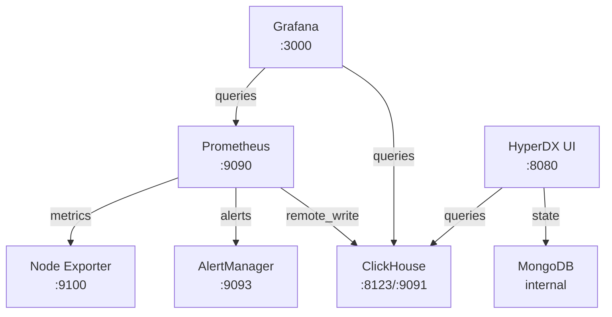

# ClickStack

A complete observability stack built around ClickHouse for high-performance metrics storage and analytics.

## Overview

ClickStack provides a modern observability platform that combines the power of ClickHouse's columnar database with industry-standard monitoring tools. It offers metrics collection, storage, visualization, and alerting in a single Docker Compose deployment.

## Architecture



## Components

- **ClickHouse**: High-performance columnar database for metrics storage
- **Prometheus**: Metrics collection and forwarding via remote write
- **HyperDX UI**: Primary observability interface and analytics
- **Grafana**: Visualization and dashboarding
- **AlertManager**: Alert routing and notification management
- **Node Exporter**: System metrics collection
- **MongoDB**: State storage for HyperDX UI

## Quick Start

### Prerequisites

- Docker and Docker Compose
- At least 4GB RAM available for containers

### Setup

1. **Clone the repository**

   ```bash
   git clone <repository-url>
   cd clickstack
   ```

2. **Start the stack**

   ```bash
   docker-compose up -d
   ```

4. **Verify deployment**

   ```bash
   docker-compose ps
   ```

### Access Services

| Service      | URL                     | Credentials      |
| ------------ | ----------------------- | ---------------- |
| HyperDX UI   | `http://localhost:8080` | No auth required |
| Grafana      | `http://localhost:3000` | admin/admin      |
| Prometheus   | `http://localhost:9090` | None             |
| AlertManager | `http://localhost:9093` | None             |
| ClickHouse   | `http://localhost:8123` | default/(empty)  |
| ClickHouse Prometheus Write | `http://localhost:9091` | None |

## Configuration

### Service Configuration

Each service has its dedicated configuration directory:

- `clickhouse/`: ClickHouse server configuration and initialization scripts
- `prometheus/`: Scrape configs and alert rules
- `alertmanager/`: Alert routing configuration
- `grafana/`: Datasources and dashboard provisioning

### Key Configuration Files

- `docker-compose.yaml`: Service orchestration and networking
- `clickhouse/init.sql`: ClickHouse database and table initialization
- `clickhouse/prometheus.xml`: Prometheus remote write endpoint configuration
- `prometheus/prometheus.yml`: Metrics collection and remote write setup
- `grafana/datasources/clickhouse.yml`: ClickHouse connection configuration
- `prometheus/rules.yml`: Alert rule definitions

### Customization

1. **Add new scrape targets**: Edit `prometheus/prometheus.yml`
2. **Configure alerts**: Modify `prometheus/rules.yml` and `alertmanager/alertmanager.yml`
3. **Add dashboards**: Place JSON files in `grafana/dashboards/`
4. **Modify retention**: Adjust Prometheus `--storage.tsdb.retention.time` in docker-compose.yaml

## Data Flow

1. **Collection**: Node Exporter exposes system metrics
2. **Ingestion**: Prometheus scrapes metrics from all configured targets
3. **Storage**: Prometheus forwards all metrics to ClickHouse via remote write (port 9091)
4. **Database**: ClickHouse stores metrics in the `otel` database using OpenTelemetry-compatible tables
5. **Visualization**: Grafana and HyperDX query ClickHouse for analytics
6. **Alerting**: Prometheus evaluates rules and sends alerts to AlertManager

## Management Commands

### Start/Stop Services

```bash
# Start all services
docker-compose up -d

# Stop all services
docker-compose down

# Restart specific service
docker-compose restart prometheus

# View logs
docker-compose logs -f grafana
```

### Configuration Reload

```bash
# Reload Prometheus configuration
curl -X POST http://localhost:9090/-/reload

# Restart Grafana to reload dashboards
docker-compose restart grafana
```

### Data Management

```bash
# Remove all data (reset to clean state)
docker-compose down -v

# Backup ClickHouse data
docker-compose exec clickhouse clickhouse-client --query "BACKUP DATABASE otel TO Disk('backups', 'backup_name')"
```

### Validation

```bash
# Validate YAML configuration
yamllint .

# Check spelling in documentation
cspell "**/*.md"
```

## Monitoring and Alerts

### Default Alerts

The stack includes basic system monitoring alerts:

- **HighCPU**: CPU usage > 80% for 2 minutes
- **HighMemory**: Memory usage > 85% for 2 minutes
- **DiskSpaceLow**: Disk usage > 90% for 2 minutes
- **ClickHouseDown**: ClickHouse service unavailable
- **PrometheusTargetDown**: Any scrape target down for 2 minutes

### Custom Metrics

Add application metrics by:

1. Exposing metrics in Prometheus format
2. Adding scrape target to `prometheus/prometheus.yml`
3. Creating dashboards in Grafana
4. Defining alert rules in `prometheus/rules.yml`

## Troubleshooting

### Common Issues

**ClickHouse connection errors**

- Verify ClickHouse is running: `docker-compose ps clickhouse`
- Check logs: `docker-compose logs clickhouse`
- Confirm database exists: `docker-compose exec clickhouse clickhouse-client --query "SHOW DATABASES"`

**Missing metrics in Grafana**

- Verify Prometheus remote write: Check `http://localhost:9090/config`
- Test ClickHouse datasource in Grafana
- Check ClickHouse table: `SELECT count() FROM otel.otel_metrics_v2`
- Verify ClickHouse Prometheus endpoint: `http://localhost:9091/api/v1/write`

**HyperDX UI not loading**

- Verify MongoDB connection: `docker-compose logs mongodb`
- Check HyperDX logs: `docker-compose logs hyperdx-ui`
- Ensure authentication is disabled: `HDX_AUTH_DISABLED=true`

### Performance Tuning

**ClickHouse Optimization**

- Adjust `max_memory_usage` in `clickhouse/users.xml`
- Configure appropriate retention policies
- Monitor disk usage and add compression settings

**Prometheus Resource Usage**

- Tune `--storage.tsdb.retention.time` based on needs
- Adjust scrape intervals for less critical metrics
- Configure recording rules for expensive queries
